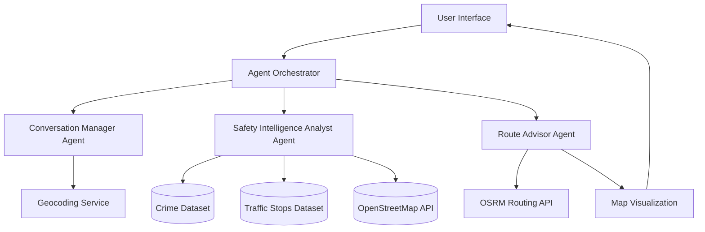
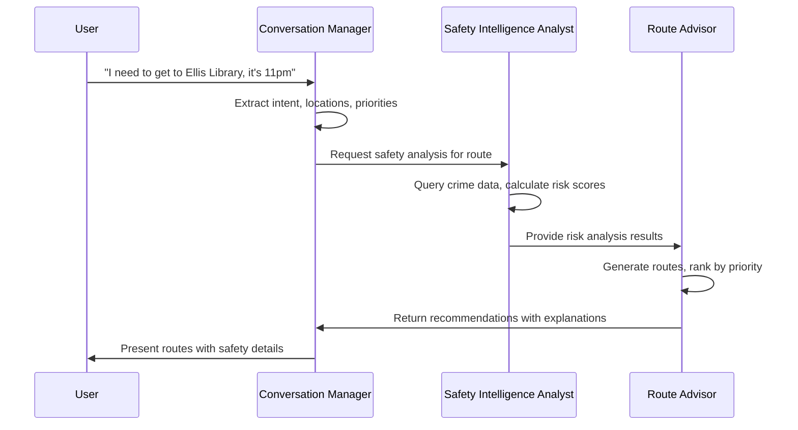
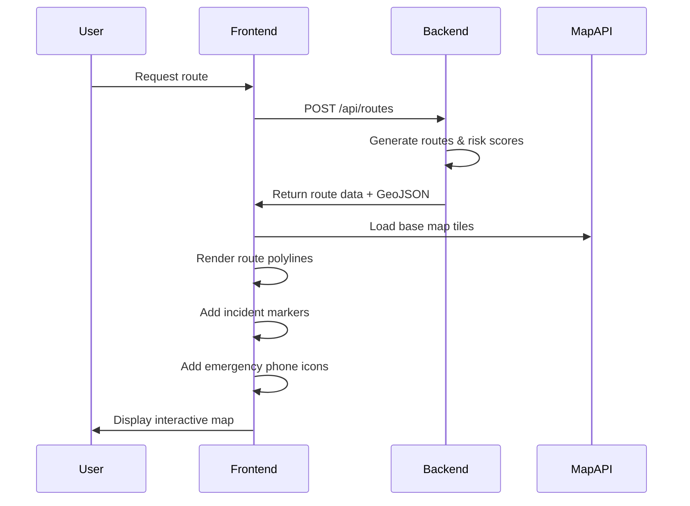

# Design Document: Campus Dispatch Copilot

## Overview

The Campus Dispatch Copilot is a multi-agent AI system that provides safe route recommendations through natural conversation. The system architecture consists of three specialized agents coordinated through a central orchestrator, with each agent having access to specific tools for data retrieval and analysis.

The design emphasizes:
- **Explainability**: All recommendations include transparent reasoning with data citations
- **Modularity**: Agents communicate through well-defined interfaces
- **Simplicity**: Transparent algorithms over complex ML models
- **Real-time Analysis**: Dynamic risk assessment based on current conditions

## Architecture

### System Components



### Agent Communication Flow



### Technology Stack

- **Agent Framework**: Multi-agent orchestration system (e.g., LangChain, AutoGen, or custom)
- **LLM**: GPT-4 or Claude for natural language understanding and generation
- **Routing Engine**: OSRM (Open Source Routing Machine) API
- **Geocoding**: Nominatim or Google Geocoding API
- **Map Visualization**: Leaflet.js or Mapbox GL JS
- **Data Storage**: PostgreSQL with PostGIS extension for spatial queries
- **Caching**: Redis for API response caching
- **Backend**: Python with FastAPI
- **Frontend**: React with TypeScript

## Components and Interfaces

### 1. Conversation Manager Agent

**Responsibility**: Understand user intent, extract structured information, maintain conversation context

**System Prompt**:
```
You are the Conversation Manager for Campus Dispatch Copilot, a safety navigation assistant.

Your role:
1. Extract origin and destination locations from user messages
2. Identify user mode: "Student" or "Community". 
   - IF Student: Default priority is 'safety'. Enforce stricter routing rules.
   - IF Community: Default priority is 'balanced'.
3. Identify user priorities (safety, speed, or balanced)
4. Detect safety concerns or time constraints
5. Ask clarifying questions when information is ambiguous

When you extract locations and priorities, format your response as:
{
  "origin": "location name or coordinates",
  "destination": "location name or coordinates",
  "user_mode": "student" | "community",
  "priority": "safety" | "speed" | "balanced",
  "time": "current" | "future time",
  "concerns": ["list of expressed concerns"]
}

If information is missing or ambiguous, ask the user for clarification before proceeding.
```

**Tools**:
- `geocode_location(location_name: str) -> Coordinates`: Convert location names to lat/lon
- `validate_campus_boundary(coordinates: Coordinates) -> bool`: Check if location is on campus

**Input**: User message (string)

**Output**: Structured request object
```typescript
interface RouteRequest {
  origin: Coordinates;
  destination: Coordinates;
  user_mode: "student" | "community";
  priority: "safety" | "speed" | "balanced";
  time: DateTime;
  concerns: string[];
}
```

### 2. Safety Intelligence Analyst Agent

**Responsibility**: Analyze safety conditions, calculate risk scores, provide data-driven insights

**System Prompt**:
```
You are the Safety Intelligence Analyst for Campus Dispatch Copilot.

Your role:
1. Query crime data near route paths
2. Analyze patrol patterns from traffic stop data
3. Identify safety infrastructure (emergency phones, lighting)
4. Calculate risk scores using the specified algorithm
5. Generate "Actionable Safety Tips" based on crime types (e.g., "High theft area: Hide valuables")

Risk Calculation Formula:
- Base score: 10 points per incident within 500m
- Temporal weight: 5x multiplier for incidents within 30 days
- Time multiplier: 2x for routes after 10pm or before 6am
- Emergency phones: -5 points each (max -15)
- Poor lighting: +10 points
- High patrol frequency: -10 points
- Final score clamped to 0-100 range

Safety Tip Logic:
- If >3 Thefts in area: Suggest hiding jewelry/phones.
- If >1 Assault/Kidnapping: Suggest staying in groups or avoiding area entirely.
- If Community Mode: Focus warnings on Vehicle Theft/Burglary.
- If Student Mode: Focus warnings on Personal Safety/Harassment.

Always cite specific data points in your analysis.
```

**Tools**:
- `query_crime_incidents(route_geometry: LineString, radius_m: int, days_back: int) -> List[Incident]`
- `query_traffic_stops(route_geometry: LineString, radius_m: int) -> PatrolData`
- `query_osm_infrastructure(route_geometry: LineString, radius_m: int) -> Infrastructure`
- `calculate_risk_score(incidents: List[Incident], infrastructure: Infrastructure, time: DateTime) -> RiskScore`
- `generate_safety_tips(incidents: List[Incident], mode: str) -> List[SafetyTip]`

**Input**: Route geometry and analysis parameters
```typescript
interface AnalysisRequest {
  route_geometry: LineString;
  user_mode: "student" | "community";
  current_time: DateTime;
  spatial_radius: number; // meters
  temporal_window: number; // days
}
```

**Output**: Safety analysis results
```typescript
interface SafetyAnalysis {
  risk_score: number; // 0-100
  incident_count: number;
  recent_incidents: Incident[];
  emergency_phones: number;
  lighting_quality: "good" | "moderate" | "poor";
  patrol_frequency: "high" | "moderate" | "low";
  actionable_tips: SafetyTip[]; // Added: Specific advice strings
  contributing_factors: string[];
}

interface SafetyTip {
  type: "warning" | "advisory";
  message: string; // e.g. "Don't carry valuable jewelry here"
  trigger_crime: string; // e.g. "Larceny"
}
```

### 3. Route Advisor Agent

**Responsibility**: Generate route options, rank by priority, create explainable recommendations

**System Prompt**:
```
You are the Route Advisor for Campus Dispatch Copilot.

Your role:
1. Generate multiple walking route options using OSRM
2. Rank routes based on user priorities
3. Calculate "Safety Percentage Improvement" vs the fastest route
4. Create natural language explanations for recommendations
5. Cite specific data points from safety analysis
6. Present trade-offs clearly (safety vs speed)

Ranking Logic:
- Safety priority: Sort by risk_score (ascending)
- Speed priority: Sort by duration (ascending)
- Balanced priority: Sort by weighted score (0.6 * normalized_risk + 0.4 * normalized_duration)

Comparison Logic:
- Calculate how much safer the recommended route is compared to the shortest path.
- Format: "This route is X% safer but takes Y minutes longer."

Your explanations should:
- State the recommendation clearly
- Explain WHY it's recommended
- Cite specific data (incident counts, features)
- Acknowledge trade-offs
- Use accessible language (avoid jargon)
```

**Tools**:
- `generate_routes(origin: Coordinates, destination: Coordinates, alternatives: int) -> List[Route]`
- `rank_routes(routes: List[Route], safety_analyses: List[SafetyAnalysis], priority: Priority) -> List[RankedRoute]`

**Input**: Routes with safety analyses and user priority
```typescript
interface RecommendationRequest {
  routes: Route[];
  safety_analyses: SafetyAnalysis[];
  priority: "safety" | "speed" | "balanced";
  user_concerns: string[];
}
```

**Output**: Ranked recommendations with explanations
```typescript
interface Recommendation {
  routes: RankedRoute[];
  primary_recommendation: RankedRoute;
  explanation: string;
  comparison: string;
}

interface RankedRoute {
  rank: number;
  route: Route;
  safety_analysis: SafetyAnalysis;
  duration_minutes: number;
  distance_meters: number;
  safety_improvement_percent: number; // Added: e.g. 40 (40% safer)
  time_tradeoff_minutes: number;      // Added: e.g. 5 (5 mins slower)
  explanation: string;
}
```

### 4. Agent Orchestrator

**Responsibility**: Coordinate agent interactions, manage conversation state, handle errors

**Workflow**:
1. Receive user message
2. Route to Conversation Manager for intent extraction
3. If locations extracted, pass to Safety Intelligence Analyst
4. Pass safety analysis to Route Advisor
5. Return recommendations to user via Conversation Manager
6. Handle errors and fallbacks at each step

**Error Handling**:
- If geocoding fails: Ask Conversation Manager to request clarification
- If OSRM fails: Return error message, suggest retry
- If crime data unavailable: Generate routes with warning
- If any agent times out: Log error, provide graceful degradation

## Data Models

### Core Data Structures

```typescript
// Geographic primitives
interface Coordinates {
  latitude: number;
  longitude: number;
}

interface LineString {
  type: "LineString";
  coordinates: [number, number][]; // [lon, lat] pairs
}

// Route representation
interface Route {
  id: string;
  geometry: LineString;
  distance_meters: number;
  duration_seconds: number;
  waypoints: Coordinates[];
}

// Crime incident
interface Incident {
  id: string;
  type: string; // "theft", "assault", "vandalism", etc.
  location: Coordinates;
  date: DateTime;
  description: string;
  severity: "low" | "medium" | "high";
}

// Traffic stop data
interface PatrolData {
  location_area: string;
  stop_count: number;
  time_distribution: Record<string, number>; // hour -> count
  patrol_frequency: "high" | "moderate" | "low";
}

// Infrastructure data
interface Infrastructure {
  emergency_phones: Coordinates[];
  lighting_segments: LightingSegment[];
  sidewalks: LineString[];
  buildings: Building[];
}

interface LightingSegment {
  geometry: LineString;
  quality: "good" | "moderate" | "poor";
}

interface Building {
  name: string;
  type: string;
  location: Coordinates;
}

// Risk assessment
interface RiskScore {
  value: number; // 0-100
  breakdown: {
    base_score: number;
    temporal_adjustment: number;
    time_of_day_multiplier: number;
    infrastructure_adjustment: number;
    patrol_adjustment: number;
  };
}
```

### Database Schema

**Crime Incidents Table**:
```sql
CREATE TABLE crime_incidents (
  id SERIAL PRIMARY KEY,
  incident_type VARCHAR(100) NOT NULL,
  location GEOGRAPHY(POINT, 4326) NOT NULL,
  incident_date TIMESTAMP NOT NULL,
  description TEXT,
  severity VARCHAR(20),
  created_at TIMESTAMP DEFAULT NOW()
);

CREATE INDEX idx_crime_location ON crime_incidents USING GIST(location);
CREATE INDEX idx_crime_date ON crime_incidents(incident_date);
```

**Traffic Stops Table**:
```sql
CREATE TABLE traffic_stops (
  id SERIAL PRIMARY KEY,
  location GEOGRAPHY(POINT, 4326) NOT NULL,
  stop_date TIMESTAMP NOT NULL,
  stop_time TIME NOT NULL,
  area_name VARCHAR(100),
  created_at TIMESTAMP DEFAULT NOW()
);

CREATE INDEX idx_traffic_location ON traffic_stops USING GIST(location);
CREATE INDEX idx_traffic_time ON traffic_stops(stop_time);
```

**OSM Infrastructure Cache Table**:
```sql
CREATE TABLE osm_infrastructure (
  id SERIAL PRIMARY KEY,
  feature_type VARCHAR(50) NOT NULL, -- 'emergency_phone', 'lighting', 'sidewalk'
  geometry GEOGRAPHY NOT NULL,
  properties JSONB,
  last_updated TIMESTAMP DEFAULT NOW()
);

CREATE INDEX idx_osm_geometry ON osm_infrastructure USING GIST(geometry);
CREATE INDEX idx_osm_type ON osm_infrastructure(feature_type);
```

**Route Cache Table**:
```sql
CREATE TABLE route_cache (
  id SERIAL PRIMARY KEY,
  origin_lat DECIMAL(10, 8) NOT NULL,
  origin_lon DECIMAL(11, 8) NOT NULL,
  dest_lat DECIMAL(10, 8) NOT NULL,
  dest_lon DECIMAL(11, 8) NOT NULL,
  route_geometry GEOGRAPHY(LINESTRING, 4326) NOT NULL,
  distance_meters INTEGER NOT NULL,
  duration_seconds INTEGER NOT NULL,
  created_at TIMESTAMP DEFAULT NOW(),
  expires_at TIMESTAMP NOT NULL
);

CREATE INDEX idx_route_origin ON route_cache(origin_lat, origin_lon);
CREATE INDEX idx_route_expires ON route_cache(expires_at);
```

## API Contracts

### Internal Agent Communication

**Conversation Manager → Safety Intelligence Analyst**:
```json
{
  "request_id": "uuid",
  "user_mode": "student",
  "routes": [
    {
      "id": "route_1",
      "geometry": { "type": "LineString", "coordinates": [[lon, lat], ...] },
      "distance_meters": 850,
      "duration_seconds": 480
    }
  ],
  "analysis_params": {
    "current_time": "2024-01-15T23:00:00Z",
    "spatial_radius_m": 500,
    "temporal_window_days": 30
  }
}
```

**Safety Intelligence Analyst → Route Advisor**:
```json
{
  "request_id": "uuid",
  "analyses": [
    {
      "route_id": "route_1",
      "risk_score": 15,
      "risk_breakdown": {
        "base_score": 0,
        "temporal_adjustment": 0,
        "time_multiplier": 2.0,
        "infrastructure_adjustment": -10,
        "patrol_adjustment": -10
      },
      "actionable_tips": [
          {
              "type": "advisory",
              "message": "Low theft area, but keep phones secure.",
              "trigger_crime": "Theft"
          }
      ],
      "incident_count": 0,
      "recent_incidents": [],
      "emergency_phones": 2,
      "lighting_quality": "good",
      "patrol_frequency": "high",
      "data_citations": [
        "Zero incidents reported within 500m in past 30 days",
        "2 emergency call boxes along route",
        "Well-lit main pathway"
      ]
    }
  ]
}
```

**Route Advisor → Conversation Manager**:
```json
{
  "request_id": "uuid",
  "recommendation": {
    "primary_route": {
      "route_id": "route_1",
      "rank": 1,
      "duration_minutes": 8,
      "distance_meters": 850,
      "risk_score": 15,
      "risk_level": "Very Safe",
      "safety_improvement_percent": 45,
      "time_tradeoff_minutes": 2,
      "explanation": "I recommend taking the longer route via Conley Avenue. Here's why: This path is well-lit with 2 emergency call boxes. It is 45% safer than the shortest route based on historical data."
    },
    "alternative_routes": [
      {
        "route_id": "route_2",
        "rank": 2,
        "duration_minutes": 6,
        "distance_meters": 650,
        "risk_score": 65,
        "risk_level": "Moderate Risk",
        "explanation": "This shortcut through the parking lot is 2 minutes faster but has higher risk. One theft was reported last week nearby."
      }
    ],
    "comparison": "Route A takes 2 minutes longer but is 45% safer based on crime density. Given that it's 11pm, I recommend prioritizing the safer route."
  }
}
```

### External API Integration

**OSRM Routing API**:
```
GET /route/v1/foot/{lon},{lat};{lon},{lat}?alternatives=2&steps=true&geometries=geojson

Response:
{
  "code": "Ok",
  "routes": [
    {
      "geometry": { "type": "LineString", "coordinates": [...] },
      "distance": 850.5,
      "duration": 480.2,
      "legs": [...]
    }
  ]
}
```

**Nominatim Geocoding API**:
```
GET /search?q=Ellis+Library+Columbia+MO&format=json&limit=1

Response:
[
  {
    "lat": "38.9446",
    "lon": "-92.3266",
    "display_name": "Ellis Library, University of Missouri, Columbia, MO"
  }
]
```

**Overpass API (OpenStreetMap)**:
```
POST /api/interpreter

Query:
[out:json];
(
  node["emergency"="phone"](around:100,38.9446,-92.3266);
  way["highway"]["lit"="yes"](around:100,38.9446,-92.3266);
);
out geom;

Response:
{
  "elements": [
    {
      "type": "node",
      "id": 123456,
      "lat": 38.9448,
      "lon": -92.3268,
      "tags": { "emergency": "phone" }
    }
  ]
}
```

## Risk Scoring Algorithm

### Detailed Calculation Steps

**Step 1: Base Score Calculation**
```python
def calculate_base_score(incidents: List[Incident], spatial_radius: float) -> float:
    """
    Calculate base risk score from incident count.
    
    Args:
        incidents: List of incidents within spatial_radius of route
        spatial_radius: Search radius in meters (default 500m)
    
    Returns:
        Base score (10 points per incident)
    """
    return len(incidents) * 10
```

**Step 2: Temporal Weighting**
```python
def apply_temporal_weight(incidents: List[Incident], current_time: DateTime) -> float:
    """
    Apply temporal decay to incident scores.
    
    Recent incidents (within 30 days) are weighted 5x more heavily.
    Older incidents contribute less to the risk score.
    
    Args:
        incidents: List of incidents with dates
        current_time: Current timestamp for recency calculation
    
    Returns:
        Temporally-weighted score
    """
    weighted_score = 0
    for incident in incidents:
        days_ago = (current_time - incident.date).days
        
        if days_ago <= 30:
            weight = 5.0  # Recent incidents weighted heavily
        elif days_ago <= 90:
            weight = 2.0  # Moderately recent
        else:
            weight = 1.0  # Older incidents
        
        weighted_score += 10 * weight
    
    return weighted_score
```

**Step 3: Time-of-Day Multiplier**
```python
def apply_time_multiplier(base_score: float, current_time: DateTime) -> float:
    """
    Apply time-of-day risk multiplier.
    
    Routes during high-risk hours (10pm-6am) have 2x risk.
    
    Args:
        base_score: Score before time adjustment
        current_time: Current timestamp
    
    Returns:
        Time-adjusted score
    """
    hour = current_time.hour
    
    if hour >= 22 or hour < 6:  # 10pm to 6am
        return base_score * 2.0
    else:
        return base_score
```

**Step 4: Infrastructure Adjustments**
```python
def apply_infrastructure_adjustments(
    score: float,
    emergency_phones: int,
    lighting_quality: str,
    patrol_frequency: str
) -> float:
    """
    Adjust risk score based on safety infrastructure.
    
    Args:
        score: Current risk score
        emergency_phones: Count of emergency phones along route
        lighting_quality: "good", "moderate", or "poor"
        patrol_frequency: "high", "moderate", or "low"
    
    Returns:
        Infrastructure-adjusted score
    """
    # Emergency phones reduce risk (max -15 points)
    phone_adjustment = min(emergency_phones * -5, -15)
    
    # Lighting affects risk
    lighting_adjustment = {
        "good": 0,
        "moderate": 5,
        "poor": 10
    }[lighting_quality]
    
    # Patrol frequency affects risk
    patrol_adjustment = {
        "high": -10,
        "moderate": 0,
        "low": 5
    }[patrol_frequency]
    
    adjusted_score = score + phone_adjustment + lighting_adjustment + patrol_adjustment
    
    # Clamp to 0-100 range
    return max(0, min(100, adjusted_score))
```

**Step 5: Context-Aware Safety Tips Logic**
```python
def generate_context_aware_tips(incidents: List[Incident], user_mode: str) -> List[SafetyTip]:
    """
    Generate actionable advice based on dominant crime types and user mode.
    """
    tips = []
    # Cluster crimes by type
    crime_counts = count_by_type(incidents)
    
    # Logic for Student Mode
    if user_mode == "student":
        if crime_counts.get('Theft', 0) > 2:
            tips.append({
                "type": "advisory",
                "message": "High theft reports in this area. Please keep jewelry and phones hidden.",
                "trigger_crime": "Theft"
            })
        if crime_counts.get('Assault', 0) > 0 or crime_counts.get('Kidnapping', 0) > 0:
            tips.append({
                "type": "warning",
                "message": "Critical: High risk incidents reported. Do not walk alone here.",
                "trigger_crime": "Personal Safety"
            })

    # Logic for Community Mode
    if user_mode == "community":
        if crime_counts.get('Burglary', 0) > 2:
            tips.append({
                "type": "advisory",
                "message": "Residential burglary alerts in this zone. Ensure home windows are locked.",
                "trigger_crime": "Burglary"
            })

    return tips
```

**Complete Algorithm**:
```python
def calculate_risk_score(
    incidents: List[Incident],
    infrastructure: Infrastructure,
    current_time: DateTime,
    spatial_radius: float = 500.0
) -> RiskScore:
    """
    Calculate comprehensive risk score for a route.
    
    Returns:
        RiskScore object with value and breakdown
    """
    # Step 1: Base score
    base = calculate_base_score(incidents, spatial_radius)
    
    # Step 2: Temporal weighting
    temporal = apply_temporal_weight(incidents, current_time)
    
    # Step 3: Time-of-day multiplier
    time_adjusted = apply_time_multiplier(temporal, current_time)
    
    # Step 4: Infrastructure adjustments
    final_score = apply_infrastructure_adjustments(
        time_adjusted,
        len(infrastructure.emergency_phones),
        infrastructure.lighting_quality,
        infrastructure.patrol_frequency
    )
    
    return RiskScore(
        value=final_score,
        breakdown={
            "base_score": base,
            "temporal_adjustment": temporal - base,
            "time_of_day_multiplier": time_adjusted / temporal if temporal > 0 else 1.0,
            "infrastructure_adjustment": final_score - time_adjusted
        }
    )
```

### Risk Level Classification

```python
def classify_risk_level(risk_score: float) -> str:
    """
    Convert numerical risk score to qualitative description.
    
    Args:
        risk_score: Numerical score (0-100)
    
    Returns:
        Risk level description
    """
    if risk_score <= 20:
        return "Very Safe"
    elif risk_score <= 40:
        return "Safe"
    elif risk_score <= 60:
        return "Moderate Risk"
    elif risk_score <= 80:
        return "Higher Risk"
    else:
        return "High Risk"
```

## Caching Strategy

### Cache Layers

**1. Route Geometry Cache (Redis)**
- **Key**: `route:{origin_lat},{origin_lon}:{dest_lat},{dest_lon}`
- **TTL**: 1 hour
- **Rationale**: Route geometries rarely change, but we want to capture occasional map updates

**2. Crime Data Cache (Redis)**
- **Key**: `crime:{bbox}:{days_back}`
- **TTL**: 24 hours
- **Rationale**: Crime data updates daily, no need for real-time queries

**3. OSM Infrastructure Cache (PostgreSQL)**
- **Update Frequency**: Weekly batch job
- **Rationale**: Infrastructure (emergency phones, lighting) changes infrequently

**4. Traffic Stop Cache (Redis)**
- **Key**: `traffic:{bbox}:{time_window}`
- **TTL**: 7 days
- **Rationale**: Patrol patterns are relatively stable week-to-week

### Cache Invalidation

```python
def invalidate_crime_cache(incident: Incident):
    """
    Invalidate crime data cache when new incidents are added.
    
    Clears all cache entries that might include the new incident's location.
    """
    # Calculate bounding boxes that might contain this incident
    affected_bboxes = calculate_affected_bboxes(incident.location, radius=500)
    
    for bbox in affected_bboxes:
        redis_client.delete(f"crime:{bbox}:*")

def should_use_cache(cache_key: str, max_age_seconds: int) -> bool:
    """
    Determine if cached data is still valid.
    
    Args:
        cache_key: Redis cache key
        max_age_seconds: Maximum acceptable age
    
    Returns:
        True if cache should be used, False if refresh needed
    """
    cached_data = redis_client.get(cache_key)
    
    if cached_data is None:
        return False
    
    cache_age = redis_client.ttl(cache_key)
    return cache_age > 0 and cache_age < max_age_seconds
```

## Map Visualization

### Frontend Components

**Map Display**:
- **Library**: Leaflet.js with custom styling
- **Base Layer**: OpenStreetMap tiles
- **Overlay Layers**:
  - Route paths (color-coded by risk)
  - Incident markers (clustered when zoomed out)
  - Emergency phone icons
  - User location marker

**Color Coding**:
```javascript
function getRouteColor(riskScore) {
  if (riskScore <= 20) return '#22c55e';      // Green - Very Safe
  if (riskScore <= 40) return '#84cc16';      // Light Green - Safe
  if (riskScore <= 60) return '#eab308';      // Yellow - Moderate
  if (riskScore <= 80) return '#f97316';      // Orange - Higher Risk
  return '#ef4444';                            // Red - High Risk
}
```

**Interactive Features**:
- Click route to see detailed safety breakdown
- Click incident marker to see incident details
- Hover over route segments to see local risk factors
- Toggle layers (incidents, emergency phones, patrol areas)

### Map Rendering Flow




## Correctness Properties

*A property is a characteristic or behavior that should hold true across all valid executions of a system—essentially, a formal statement about what the system should do. Properties serve as the bridge between human-readable specifications and machine-verifiable correctness guarantees.*

### Property 1: Intent Extraction Completeness

*For any* user message containing location and priority information, the Conversation_Manager should extract all present fields (origin, destination, priority, concerns) into the structured request object.

**Validates: Requirements 1.1, 1.3, 1.4**

### Property 2: Disambiguation Triggers

*For any* user message with ambiguous location references, the Conversation_Manager should request clarification rather than making assumptions about the intended location.

**Validates: Requirements 1.2**

### Property 3: Conversation Context Preservation

*For any* sequence of messages in a conversation, information extracted from earlier messages should remain accessible in later turns unless explicitly overridden by the user.

**Validates: Requirements 1.5**

### Property 4: Agent Communication Chain Integrity

*For any* route request, data should flow through all three agents in order (Conversation_Manager → Safety_Intelligence_Analyst → Route_Advisor → Conversation_Manager) with each agent receiving the expected input structure from the previous agent.

**Validates: Requirements 2.1, 2.2, 2.3, 2.4**

### Property 5: Graceful Agent Failure Handling

*For any* agent failure scenario, the system should log the error with sufficient detail and return a user-friendly error message without exposing internal implementation details.

**Validates: Requirements 2.5, 12.4, 12.5**

### Property 6: Route Generation Cardinality

*For any* valid origin-destination pair, the Route_Advisor should generate at least 2 alternative routes (or 1 if only one path exists) suitable for pedestrian travel.

**Validates: Requirements 3.1, 3.4, 9.4**

### Property 7: Route Data Completeness

*For any* generated route, the output should include all required fields: geometry, distance, duration, and waypoint coordinates.

**Validates: Requirements 3.2, 3.5**

### Property 8: Route Generation Error Handling

*For any* OSRM API failure or empty response, the Route_Advisor should return an appropriate error message indicating that no paths are available.

**Validates: Requirements 3.3**

### Property 9: Spatial Query Correctness

*For any* route geometry, queries for incidents, traffic stops, and emergency phones should only return results within the specified spatial radius (500m for incidents/traffic, 100m for emergency phones).

**Validates: Requirements 4.1, 5.1, 6.1**

### Property 10: Incident Data Filtering

*For any* incident query, the results should be filtered by all specified criteria (type, location, date) and only matching incidents should be returned.

**Validates: Requirements 4.2**

### Property 11: Incident Data Parsing

*For any* incident record, the parsed result should contain all required fields: incident type, location, date, and description.

**Validates: Requirements 4.3**

### Property 12: Malformed Data Handling

*For any* malformed or incomplete incident record, the Safety_Intelligence_Analyst should handle it gracefully without crashing or corrupting the analysis.

**Validates: Requirements 4.5**

### Property 13: Patrol Frequency Extraction

*For any* traffic stop query result, the Safety_Intelligence_Analyst should correctly aggregate stops by location and time of day to calculate patrol frequency.

**Validates: Requirements 5.2, 5.4**

### Property 14: Infrastructure Data Extraction

*For any* route, the Safety_Intelligence_Analyst should extract all relevant infrastructure data from OpenStreetMap: emergency phones, lighting segments, sidewalks, and building types.

**Validates: Requirements 6.2, 6.3, 6.4, 6.5**

### Property 15: Risk Score Bounds Invariant

*For any* route analysis with any combination of input data, the calculated Risk_Score should always be within the range [0, 100] inclusive.

**Validates: Requirements 7.1**

### Property 16: Risk Calculation Algorithm Correctness

*For any* route with known incident data, infrastructure, and time parameters, the risk score should be calculated according to the specified algorithm:
- Base score: 10 points per incident within 500m
- Temporal weight: 5x for incidents within 30 days, 2x for 30-90 days, 1x for older
- Time multiplier: 2x for hours between 10pm-6am
- Emergency phones: -5 points each (max -15)
- Poor lighting: +10 points
- High patrol frequency: -10 points
- Final score clamped to [0, 100]

**Validates: Requirements 7.2, 7.3, 7.4, 7.5, 7.6, 7.7**

### Property 17: Patrol Frequency as Safety Factor

*For any* two routes with identical characteristics except patrol frequency, the route with higher patrol frequency should have a lower or equal risk score.

**Validates: Requirements 5.3**

### Property 18: Explanation Presence

*For any* route recommendation, the Route_Advisor should provide a non-empty natural language explanation of the safety assessment.

**Validates: Requirements 8.1**

### Property 19: Data Citation in Explanations

*For any* route explanation, the text should contain at least one specific reference to data from the safety analysis (incident counts, infrastructure features, or patrol information).

**Validates: Requirements 8.2**

### Property 20: Comparative Explanations

*For any* recommendation with multiple routes, the explanation should include a comparison highlighting key differences in safety factors between options.

**Validates: Requirements 8.3**

### Property 21: Risk-Appropriate Messaging

*For any* route with risk score above 60, the explanation should explicitly state concerning factors; for routes with risk score below 30, the explanation should highlight positive safety features.

**Validates: Requirements 8.4, 8.5**

### Property 22: Risk Score Presentation Format

*For any* route recommendation, the output should include both the numerical risk score (X/100) and a qualitative description (e.g., "Very Safe", "Moderate Risk").

**Validates: Requirements 8.6**

### Property 23: Safety-Priority Ranking

*For any* route request with safety priority, routes should be ranked in ascending order by risk score (lowest risk first).

**Validates: Requirements 9.1**

### Property 24: Speed-Priority Ranking

*For any* route request with speed priority, routes should be ranked in ascending order by estimated duration (shortest time first).

**Validates: Requirements 9.2**

### Property 25: Balanced Ranking Algorithm

*For any* route request with balanced priority, routes should be ranked by the weighted formula: score = (normalized_risk × 0.6) + (normalized_duration × 0.4), where lower scores rank higher.

**Validates: Requirements 9.3**

### Property 26: Recommendation Clarity

*For any* route recommendation, the primary (rank 1) route should be clearly labeled and include an explanation of why it was chosen over alternatives.

**Validates: Requirements 9.5**

### Property 27: Map Visualization Completeness

*For any* map display, all generated routes should be rendered with distinct colors based on risk level (green for 0-20, light green for 21-40, yellow for 41-60, orange for 61-80, red for 81-100), and all incidents and emergency phones should be marked with appropriate icons.

**Validates: Requirements 10.1, 10.2, 10.3, 10.4**

### Property 28: Cache TTL Correctness

*For any* cached data, the cache should expire according to the specified TTL: 24 hours for crime data, 7 days for OSM data, 1 hour for OSRM routes.

**Validates: Requirements 11.1, 11.2, 11.3**

### Property 29: Cache Invalidation on Data Update

*For any* new incident added to the crime dataset, all cache entries that might contain the incident's location (within 500m) should be invalidated.

**Validates: Requirements 11.4**

### Property 30: Force Refresh Bypass

*For any* request with force-refresh flag, the system should bypass cache and fetch fresh data from the source.

**Validates: Requirements 11.5**

### Property 31: Graceful Degradation for Crime Data

*For any* route request when crime data is unavailable, the system should generate routes and include a warning that safety data is incomplete.

**Validates: Requirements 12.1**

### Property 32: OSRM Failure Error Handling

*For any* route request when OSRM API is unavailable, the system should return an error message suggesting the user try again later.

**Validates: Requirements 12.2**

### Property 33: OSM Failure Graceful Degradation

*For any* route request when OpenStreetMap data is unavailable, the system should calculate risk scores without infrastructure factors and note the limitation in the response.

**Validates: Requirements 12.3**

### Property 34: Location Name Geocoding

*For any* user-provided location name, the Conversation_Manager should convert it to geographic coordinates using the geocoding service.

**Validates: Requirements 13.1**

### Property 35: Location Disambiguation

*For any* ambiguous location name that returns multiple geocoding results, the Conversation_Manager should present options and ask the user to clarify.

**Validates: Requirements 13.2**

### Property 36: Campus Landmark Recognition

*For any* common campus landmark or building name, the Conversation_Manager should correctly geocode it to the appropriate coordinates.

**Validates: Requirements 13.3**

### Property 37: Geocoding Failure Handling

*For any* location name that fails to geocode, the Conversation_Manager should ask the user to provide a different location description.

**Validates: Requirements 13.4**

### Property 38: Campus Boundary Validation

*For any* geocoded coordinates, the Conversation_Manager should validate that they fall within the campus boundary before proceeding with route generation.

**Validates: Requirements 13.5**

### Property 39: Temporal Incident Filtering

*For any* route analysis during specific time periods (e.g., nighttime), the Safety_Intelligence_Analyst should filter historical incidents to only include those that occurred during similar time periods.

**Validates: Requirements 14.2**

### Property 40: Day-of-Week Pattern Analysis

*For any* route analysis, the Safety_Intelligence_Analyst should consider day-of-week patterns when analyzing incident data (e.g., weekday vs weekend patterns).

**Validates: Requirements 14.3**

### Property 41: Nighttime Safety Prioritization

*For any* route request during high-risk hours (10pm-6am), the Route_Advisor should prioritize safety over speed in the ranking algorithm (unless user explicitly requests speed priority).

**Validates: Requirements 14.4**

### Property 42: Future Time Query Support

*For any* user request specifying a future time (e.g., "I'll be walking at 11pm tonight"), the system should parse the future time and use it for time-based risk calculations.

**Validates: Requirements 14.5**

### Property 43: Initial Acknowledgment Latency

*For any* route request, the system should return an initial acknowledgment to the user within 1 second of receiving the request.

**Validates: Requirements 15.1**

### Property 44: End-to-End Response Latency

*For any* route request, the system should complete the full analysis and return final recommendations within 5 seconds.

**Validates: Requirements 15.2**

### Property 45: Progress Indication for Long Operations

*For any* operation that takes longer than 2 seconds, the system should provide progress indicators to the user.

**Validates: Requirements 15.5**

## Error Handling

### Error Categories

**1. User Input Errors**
- Invalid location names
- Ambiguous location references
- Out-of-bounds coordinates
- Malformed requests

**Handling Strategy**: Prompt user for clarification with helpful suggestions

**2. External API Failures**
- OSRM routing API unavailable
- Geocoding service failure
- OpenStreetMap API timeout

**Handling Strategy**: Return user-friendly error message, suggest retry, log technical details

**3. Data Availability Issues**
- Crime dataset unavailable
- Traffic stop data missing
- OSM infrastructure data incomplete

**Handling Strategy**: Graceful degradation with warnings about incomplete data

**4. Agent Communication Failures**
- Agent timeout
- Malformed inter-agent messages
- Agent crash

**Handling Strategy**: Log error, attempt fallback, return graceful error to user

**5. Performance Issues**
- Query timeout
- Memory exhaustion
- Rate limiting

**Handling Strategy**: Return timeout message, suggest retry, implement backoff

### Error Response Format

```typescript
interface ErrorResponse {
  error: true;
  error_code: string; // "GEOCODING_FAILED", "OSRM_UNAVAILABLE", etc.
  user_message: string; // User-friendly explanation
  suggestions: string[]; // Actionable suggestions for user
  retry_after?: number; // Seconds to wait before retry (for rate limiting)
}
```

### Logging Strategy

**Log Levels**:
- **ERROR**: Agent failures, API errors, data corruption
- **WARN**: Graceful degradation, missing optional data, slow queries
- **INFO**: Route requests, cache hits/misses, agent handoffs
- **DEBUG**: Detailed agent reasoning, query parameters, calculation steps

**Log Format**:
```json
{
  "timestamp": "2024-01-15T23:05:32Z",
  "level": "ERROR",
  "component": "Safety_Intelligence_Analyst",
  "request_id": "uuid",
  "message": "Crime data query failed",
  "error": "Connection timeout after 5s",
  "context": {
    "route_id": "route_1",
    "query_bbox": "...",
    "retry_count": 2
  }
}
```

## Testing Strategy

### Dual Testing Approach

The Campus Dispatch Copilot requires both unit testing and property-based testing for comprehensive coverage:

**Unit Tests**: Verify specific examples, edge cases, and error conditions
- Specific location pairs (e.g., "Student Center to Ellis Library")
- Edge cases (empty incident lists, single route scenarios)
- Error conditions (API failures, malformed data)
- Integration points between components

**Property Tests**: Verify universal properties across all inputs
- Risk score calculation correctness across random inputs
- Agent communication integrity with generated test data
- Ranking algorithms with various route combinations
- Cache behavior with random query patterns

### Property-Based Testing Configuration

**Testing Library**: Use `hypothesis` (Python) for property-based testing

**Test Configuration**:
- Minimum 100 iterations per property test
- Each test tagged with feature name and property number
- Tag format: `# Feature: campus-dispatch-copilot, Property N: [property description]`

**Example Property Test Structure**:
```python
from hypothesis import given, strategies as st
import pytest

@given(
    incidents=st.lists(st.builds(Incident)),
    infrastructure=st.builds(Infrastructure),
    current_time=st.datetimes()
)
def test_risk_score_bounds_invariant(incidents, infrastructure, current_time):
    """
    Feature: campus-dispatch-copilot, Property 15: Risk Score Bounds Invariant
    
    For any route analysis with any combination of input data,
    the calculated Risk_Score should always be within [0, 100].
    """
    risk_score = calculate_risk_score(incidents, infrastructure, current_time)
    
    assert 0 <= risk_score.value <= 100, \
        f"Risk score {risk_score.value} outside valid range [0, 100]"
```

### Test Coverage Requirements

**Agent Tests**:
- Conversation Manager: Intent extraction, geocoding, disambiguation
- Safety Intelligence Analyst: Data queries, risk calculation, infrastructure analysis
- Route Advisor: Route generation, ranking, explanation generation

**Integration Tests**:
- End-to-end route request flow
- Agent communication chain
- Error propagation and handling
- Cache behavior across requests

**Performance Tests**:
- Response latency under load
- Concurrent request handling
- Cache hit rates
- Database query performance

### Test Data Strategy

**Synthetic Data Generation**:
- Generate random but realistic incident data
- Create test route geometries covering various scenarios
- Build infrastructure data for different campus areas

**Real Data Samples**:
- Use anonymized samples from actual Columbia PD datasets
- Include edge cases found in production data
- Test with actual campus building names and locations

**Mocking Strategy**:
- Mock external APIs (OSRM, Nominatim, Overpass) for unit tests
- Use real APIs for integration tests with rate limiting
- Implement fake data sources for property tests

### Continuous Testing

**Pre-commit Hooks**:
- Run unit tests on changed files
- Verify code formatting and linting
- Check for common security issues

**CI/CD Pipeline**:
- Run full unit test suite on every commit
- Run property tests (100 iterations) on every PR
- Run integration tests on staging environment
- Performance benchmarks on main branch

**Test Metrics**:
- Code coverage target: 80% for core logic
- Property test success rate: 100% (no flaky tests)
- Integration test pass rate: 95%+ (allowing for external API flakiness)
- Performance regression threshold: 10% latency increase

